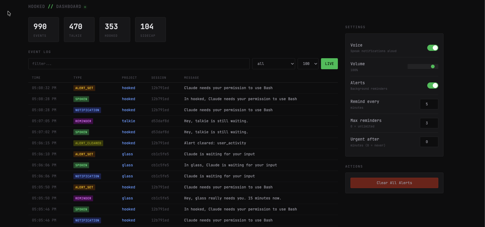

# hooked

A TypeScript toolkit for Claude Code hooks. Voice notifications and smart continuation presets.

## Features

- **Voice Notifications** - Know when Claude needs you via [SpeakEasy](https://github.com/arach/speakeasy)
- **Continuation Presets** - Keep Claude working until tests pass, build succeeds, or you say stop
- **Simple CLI** - `hooked test` to enable, `hooked off` to disable

## Quick Start

```bash
git clone https://github.com/arach/hooked.git
cd hooked && pnpm install
pnpm run hooked:init
```

## Usage

### Continuation Presets

```bash
# Keep working until tests pass
hooked test

# Keep working until build succeeds
hooked build

# Keep working until you say stop
hooked manual

# Back to normal (Claude stops when it wants)
hooked off

# Check current state
hooked status
```

### Available Presets

| Preset | Check Command | Description |
|--------|---------------|-------------|
| `test` | `pnpm test` | Keep working until tests pass |
| `build` | `pnpm build` | Keep working until build succeeds |
| `typecheck` | `pnpm typecheck` | Keep working until types are clean |
| `lint` | `pnpm lint` | Keep working until lint passes |
| `manual` | - | Keep working until explicitly stopped |

### How It Works

1. Run `hooked test` - enables the test preset
2. Claude works on your task
3. When Claude tries to stop, the hook runs `pnpm test`
4. If tests fail, Claude keeps working
5. When tests pass, continuation auto-disables

## Web Dashboard

View history, configure settings, and monitor active alerts:

```bash
hooked web          # Opens at localhost:3456, auto-closes in 10m
hooked web 8080 30  # Custom port, 30 minute timeout
```



## Configuration

Config stored in `~/.hooked/config.json`:

```json
{
  "activePreset": "test",
  "flags": {
    "speak": true,
    "logging": true
  }
}
```

## Project Structure

```
~/.hooked/
├── src/           # Hook handlers
├── state/         # Session state
├── config.json    # Active preset & flags
└── history/       # Event logs

~/.claude/
├── hooks/         # Deployed hooks
└── settings.json  # Hook configuration
```

## Stop Hook API

For custom stop hooks:

```typescript
import { createStopHook, maxIterations, continueUntil } from 'hooked/stop'

const hook = createStopHook([
  maxIterations(30),    // Safety limit
  continueUntil(),      // Preset-based continuation
])

hook()
```

### Built-in Evaluators

```typescript
import {
  maxIterations,     // Stop after N iterations
  continueUntil,     // Preset-based (hooked test/build/etc)
  commandSucceeds,   // Custom command check
  testsPass,         // Alias for commandSucceeds('pnpm test')
  buildSucceeds,     // Alias for commandSucceeds('pnpm build')
} from 'hooked/stop'
```

## Voice Notifications

Requires [SpeakEasy](https://github.com/arach/speakeasy) configured with a TTS provider:

```bash
npm install -g @arach/speakeasy
speakeasy config
```

Notifications announce when Claude needs attention:
- "In hooked, Claude needs your permission"
- "In hooked, Claude is waiting for you"

## Development

```bash
# Test the CLI
npx tsx src/cli/commands.ts status
npx tsx src/cli/commands.ts test
npx tsx src/cli/commands.ts off

# Test the stop hook
echo '{"session_id":"test","transcript_path":"/test"}' | npx tsx src/stop/default-hook.ts

# Watch logs
tail -f ~/logs/claude-hooks/notification.log
```

## Resources

- [Claude Code Hooks Guide](https://code.claude.com/docs/en/hooks-guide)
- [SpeakEasy TTS Library](https://github.com/arach/speakeasy)

---

**Default: OFF** - Continuation only activates when you explicitly enable a preset.
